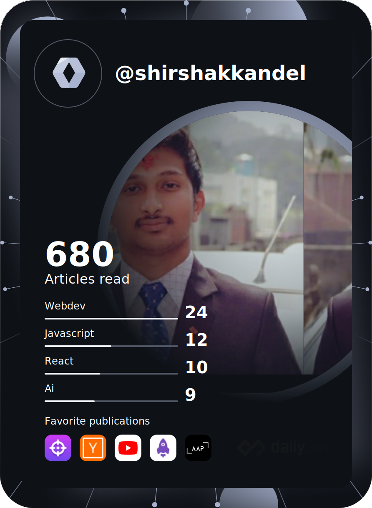

  

# Hi there, I'm Shirshak kandel 👋 
## I'm a Javascript Developer(Full stack (Mern stack))

- 🌱 I’m currently learning Web3(Solidity),strapi headless cms,Google app script and Discord bot
- 👯 I’m looking to collaborate with other developers in Mern stack project
- 🥅 2022 Goals: Learn more about web3
- ⚡ Fun fact: I love to play Table Tennis,Cricket,basketball and Football.

### Connect with me:

### Languages and Tools:

 
 

 

  

  

 
